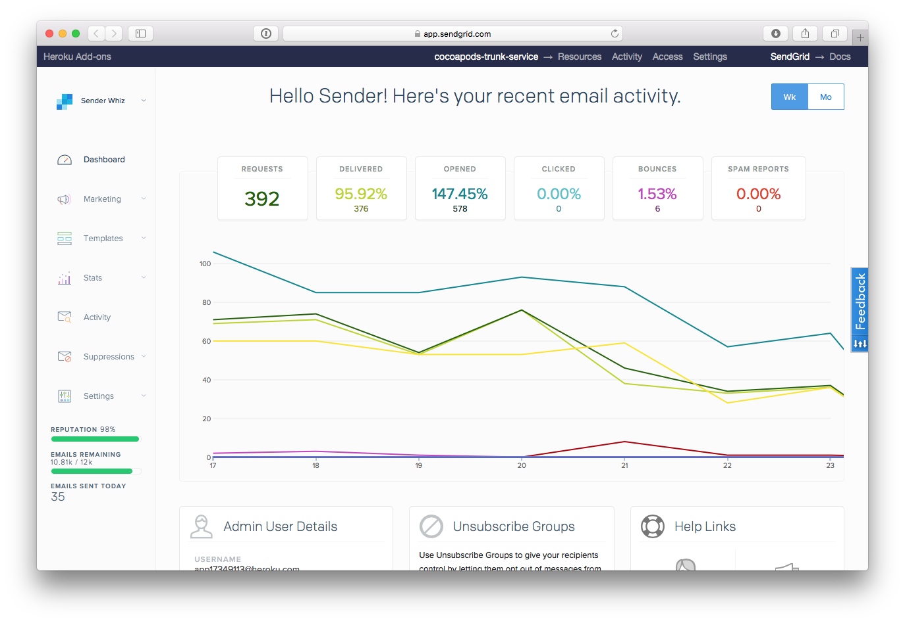

### When a user does not recieve an email

This is 99% of the time that they've had an email sent, and that returned a "user does not exist" on that account. This is called bouncing. When that happens the email gets put on a blacklist and we never try send them an email until a human, e.g. you, intervenes.

Step 1, load up heroku for trunk:

https://dashboard.heroku.com/orgs/cocoapods/overview

Step 2, click through to SendGrid

Step 3, look for their email in either "Bounce" or "Blocks"

You can guess based on their name, or ask for an email address, then you need to remove them from that list and ask them to try again.